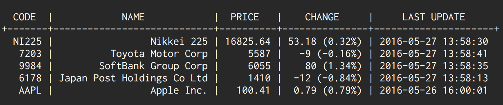

# fugo
fugo is a command-line utility to display up-to-date information about Japanese stock market.



## Usage

```
usage: fugo [--version] [--help] <command> [<args>]

Available commands are:
    add        Add stock to your portfolio
    check      Check stock data in your portfolio
    remove     Remove stock from your portfolio
    version    Print fugo version and quit
```

## Install
## Go
To install it, just use `go get` and you should be able to use `fugo` if your PATH has properly be configured.

```bash
$ go get github.com/kmagai/fugo
```

Binary distribution has not yet been supported, but will be coming soon.

## Contribution
1. Fork ([https://github.com/kmagai/fugo/fork](https://github.com/kmagai/fugo/fork))
2. Create a feature branch
3. Commit your changes
4. Rebase your local changes against the master branch
5. Run test suite with the `make test` command and confirm that it passes with `go test ./...`
6. Create a new Pull Request

## Licence
[MIT](./LICENSE)

## Author
[kmagai](https://github.com/kmagai)
